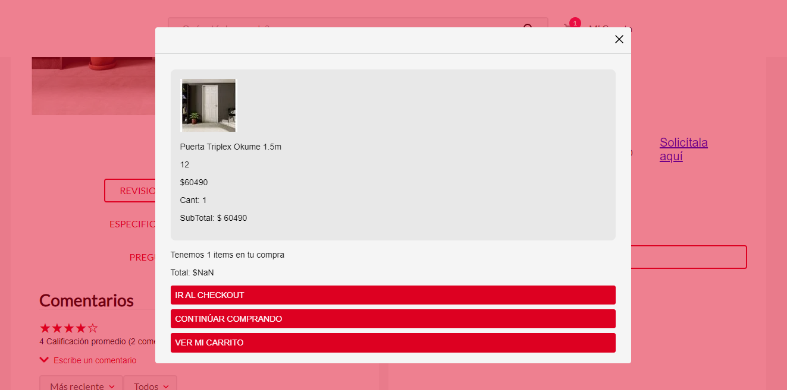

📢 Use this project, [contribute](https://github.com/{OrganizationName}/{AppName}) to it or open issues to help evolve it using [Store Discussion](https://github.com/vtex-apps/store-discussion).

<!-- DOCS-IGNORE:start -->
<!-- ALL-CONTRIBUTORS-BADGE:START - Do not remove or modify this section -->
[](#contributors-)
<!-- ALL-CONTRIBUTORS-BADGE:END -->
<!-- DOCS-IGNORE:end -->

# Add to Cart Info

This component will display additional information when the user add a new item to the shopping list.



## Configuration 

Next I will explain how to have the `Add to Cart` Info Component in the store theme:

1. Import the `Add to Cart` app to your theme's dependencies in the `manifest.json`, for example:

```
  dependencies: {
    "itgloberspartnercl.add-to-cart-info": "0.x"
  }
```

2. Add the `"add-to-cart-info"` block to the Product template. For example:
```
"children":[
  "add-to-cart-info"
]
```

**This application has no props, all you have to do is call the block**


## Customization

In order to apply CSS customizations in this and other blocks, follow the instructions given in the recipe on [Using CSS Handles for store customization](https://vtex.io/docs/recipes/style/using-css-handles-for-store-customization).

| CSS Handles |
| ----------- | 
| `container` | 
| `container__item` | 
| `container__total` | 
| `container__button` | 
| `department__button` |
| `text` |

<!-- DOCS-IGNORE:start -->

## Contributors ✨

Thanks goes to these wonderful people:

<!-- ALL-CONTRIBUTORS-LIST:START - Do not remove or modify this section -->
<!-- prettier-ignore-start -->
<!-- markdownlint-disable -->
<!-- markdownlint-enable -->
<!-- prettier-ignore-end -->
<!-- ALL-CONTRIBUTORS-LIST:END -->

This project follows the [all-contributors](https://github.com/all-contributors/all-contributors) specification. Contributions of any kind are welcome!

<!-- DOCS-IGNORE:end -->

---- 

Check out some documentation models that are already live: 
- [Breadcrumb](https://github.com/vtex-apps/breadcrumb)
- [Image](https://vtex.io/docs/components/general/vtex.store-components/image)
- [Condition Layout](https://vtex.io/docs/components/all/vtex.condition-layout@1.1.6/)
- [Add To Cart Button](https://vtex.io/docs/components/content-blocks/vtex.add-to-cart-button@0.9.0/)
- [Store Form](https://vtex.io/docs/components/all/vtex.store-form@0.3.4/)

